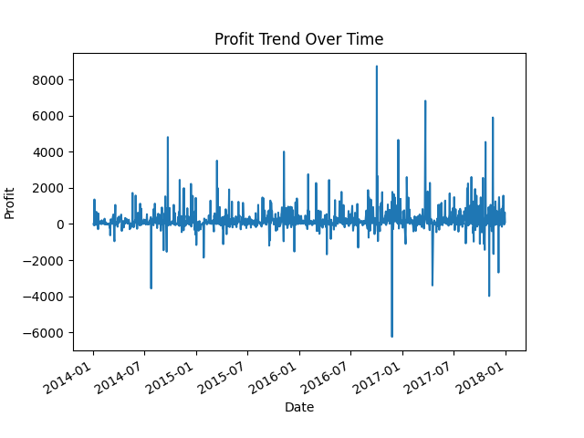
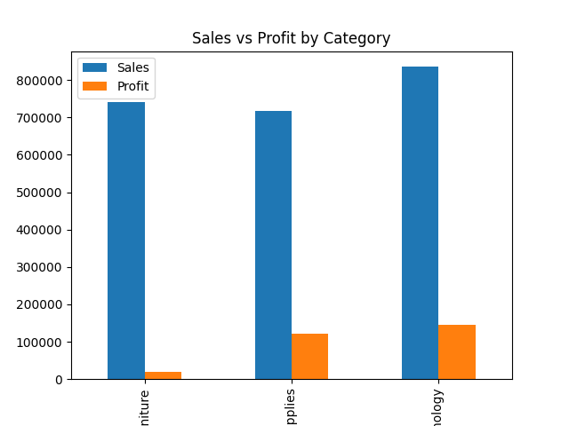
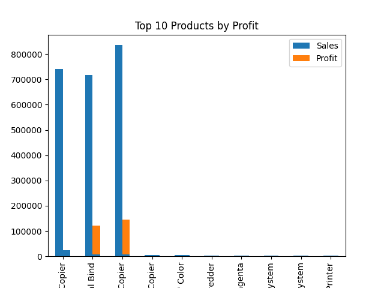

# Sales and Profit Analysis (Excel + Python)

## 📌 Overview
This project explores sales and profit performance using Excel and Python.  
It demonstrates how raw business data can be transformed into actionable insights through:
- Data cleaning
- Statistical summaries
- Visualizations with matplotlib

## 📂 Files in Repository
- **sale and profit.xlsx** → Raw dataset
- **sales_profit_clean.csv** → Cleaned dataset
- **analysis.py** → Python analysis script
- **profit_trend.png** → Profit trend chart
- **sales_profit_category.png** → Sales vs Profit by Category
- **top10_products_profit.png** → Top 10 Products by Profit

## 📊 Key Insights
- **Total Sales:** 2,295,509.57  
- **Total Profit:** 286,013.82  
- **Average Profit per Order:** 28.64  

## 📈 Visualizations
Profit and sales trends generated with Python (matplotlib):

  
  

## 🛠️ Tools Used
- **Excel** → Initial dataset exploration  
- **Python (pandas)** → Data cleaning and statistical analysis  
- **Matplotlib** → Visualizations  

## 💡 Skills Demonstrated
- Data cleaning and export (Excel → CSV → Python)  
- Grouping and aggregation with pandas  
- Chart creation with matplotlib  
- Documentation and portfolio presentation on GitHub  

## 🚀 Next Steps
- Add SQL queries for deeper analysis  
- Explore monthly/quarterly trends  
- Expand into business insights for decision‑making
